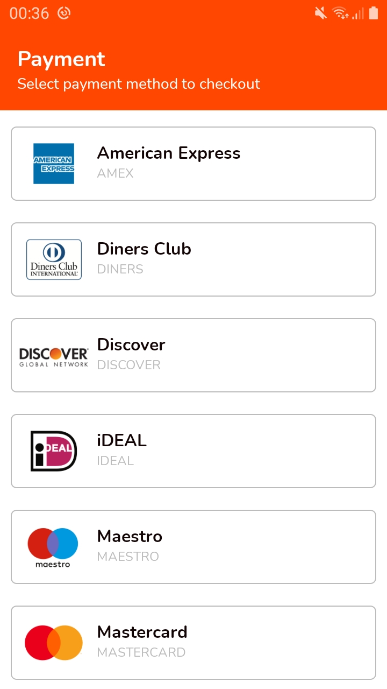

# Payoneer-Checkout

This app showcases sample payment methods available during the checkout process for the [Payoneer](https://www.payoneer.com/)
platform. The app is built using Java and encompasses the Clean Architecture principle with MVVM approach and Jetpack libraries.

## Table of Contents
- [Project Setup](#project-setup)
- [Architecture](#architecture)
- [Libraries](#libraries)
- [Screenshots](#screenshots)

## Project Setup 
To setup the project in your machine

- Clone the repo

```console
foo@bar:~$ git clone https://github.com/tirgei/payoneer-checkout.git
```

You can then import the project to your Android Studio

## Architecture
The app is divided into 3 modules, namely:
- Presentation (app)
- Data
- Domain

This approach is guided by the clean architecture approach which advocates for clear abstraction of the flow 
of data from the business logic to the presentation framework dealing with displaying data to the user. 

#### Presentation
The ```app``` module contains the UI and navigation frameworks and also deals with instantiation of DI
components for the app. [DataBinding](https://developer.android.com/topic/libraries/data-binding) is used to render data to the UI while 
the [ViewModel](https://developer.android.com/topic/libraries/architecture/viewmodel) provides a link to the ```data``` module
via the respective [UseCase](https://proandroiddev.com/why-you-need-use-cases-interactors-142e8a6fe576) s.

#### Data
The ```data``` module deals with loading data from the sample response server. In this case the data is only fetched from
a ```remote``` data source and is not cached locally. The data fetched is deserialized to the respective response class
then mapped to it's ```domain``` model equivalent.

#### Domain
The ```domain``` module mainly deals with the model classes which presents the data being used accross both the 
```presentation``` module and the ```data``` module.

It defines the UseCase(s) which handle the flow of data from the Repository layer to the ViewModel. It also defines 
the Repository interfaces which the ```data``` module implements to provide remote data access, and which can then be used to 
defines [Fakes](https://blog.pragmatists.com/test-doubles-fakes-mocks-and-stubs-1a7491dfa3da) for testing the repository layer.

## Libraries
Libraries used in the app include:
- [Jetpack](https://developer.android.com/jetpack) - Jetpack Components
  - [Navigation](https://developer.android.com/guide/navigation)
  - [ViewModel](https://developer.android.com/topic/libraries/architecture/viewmodel)
  - [LiveData](https://developer.android.com/topic/libraries/architecture/livedata)
  - [DataBinding](https://developer.android.com/topic/libraries/data-binding)
- [Dagger Hilt](https://developer.android.com/training/dependency-injection/hilt-android) - Dependency Injection framework
- [RxJava3](https://github.com/ReactiveX/RxAndroid) + [RxAndroid](https://github.com/ReactiveX/RxAndroid) - Reactive Library providing reactive frameworks for Android
- [Retrofit](https://square.github.io/retrofit/) - Types-safe HTTP client for Android
  - [Gson](https://github.com/google/gson)
  - [RxJava3AdapterFactory](https://github.com/akarnokd/RxJavaRetrofitAdapter/)
- [Timber](https://github.com/JakeWharton/timber) - Logging Library
- [Glide](https://github.com/bumptech/glide) - Image loading & caching library
- [Lottie](https://lottiefiles.com/) - Animation library client for Android

For testing, the following libraries are included:
- [JUnit](https://junit.org/junit4/) - Framework to write tests
- [Mockito](https://site.mockito.org/) - Testing mocking framework
- [Truth](https://truth.dev/) - Assertions library by Google

## Screenshots
